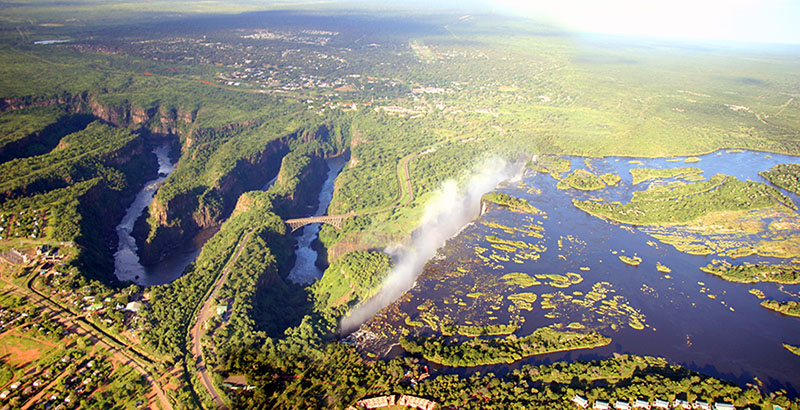
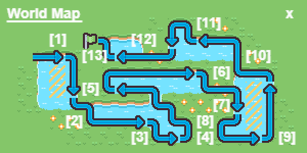
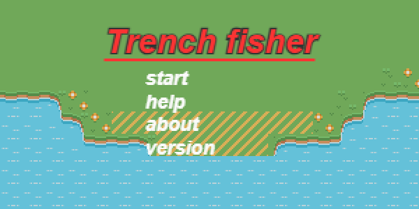

# Trench Fisher Write-Up

## [Play game](./)

## Introduction
My entry for js13kgames 2023 is "Trench Fisher." But why the title, and what really inspired this entry? Well, when I first heard about the js13k games 2023 theme, "13th century," the first idea that popped into my mind was how my hometown, "Livingstone - Area 213," might have looked in the middle ages. That idea gave rise to Trench Fisher, a game inspired by the actual geographic landmarks of my hometown[^1].

*Figure 1: Courtesy, Victoria Falls Guide*

## Development

Development of Trench Fisher began with the usual wireframing on a blank canvas, accompanied by notebook sketching, as I often do for most of the games I create. For the coding part, I was comfortably translating caffeine and my imagination into algorithms and data structures in raw JavaScript.

The following libraries were used in the development:

1. [linked-list](https://github.com/wooorm/linked-list)[^2]
2. [Kontra](https://github.com/straker/kontra)[^3]
3. [Zzfxm](https://github.com/keithclark/ZzFXM/)[^4]
4. Zzfxm samples: ["I'm Back"](https://keithclark.github.io/ZzFXM/tracker/?url=https://raw.githubusercontent.com/keithclark/ZzFXM/master/examples/songs/iamback.js)[^5]
5. Kenney's "Tiny Battle" assets[^6]

The title screen was designed to resemble the classic J2ME games, such as Gameloft's "Gangster Crime City" (2009), with a vertical column containing a title and stacked menu items.

The world map was an idea I had from the beginning. It may be classic, but I love it that way. It simply shows location of all 8 trenches joined by routes (well previously at least, till I ran out of bytes estate and removed tiles that showed routes).
Here is how it was initially laid out for a record.

Oh and wait 13 trenches? Well yeah kind, Initially I intended to name the game 13 miles it made sense at the time to add 13 trenches that’s one trench for every mile, cool :)

## Gameplay and Mechanics

The gameplay for the role-playing game Trench Fisher revolves around the idea of the player fishing in one of the eight levels, each representing a trench at Lake Kariba[^1]. It was honestly inspired by Electronic Arts' The Sims 3 franchise (2008).

## Beyond JS13KGames

I’ve started rewriting Trench fisher game in c as at the time of this write up. I’m at title screen level and I’ve since maintained the original idea but without limits, I’ve committed myself to working on it every weekend til November.

## References

1. Victoria Falls Gorge - the formation, history, threats. (n.d.). [www.victoriafalls-guide.net](https://www.victoriafalls-guide.net/gorge.html)
2. W. (n.d.). GitHub - wooorm/linked-list: Minimalistic linked lists. GitHub. [https://github.com/wooorm/linked-list](https://github.com/wooorm/linked-list)
3. S. (n.d.). GitHub - straker/kontra: A lightweight JavaScript gaming micro-library, optimized for js13kGames. GitHub. [https://github.com/straker/kontra](https://github.com/straker/kontra)
4. K. (n.d.). GitHub - keithclark/ZzFXM: A super small music generator for use in size-limited JavaScript productions. GitHub. [https://github.com/keithclark/ZzFXM/](https://github.com/keithclark/ZzFXM/)
5. ZzFXM Tracker. (n.d.). [https://keithclark.github.io/ZzFXM/tracker/?url=https://raw.githubusercontent.com/keithclark/ZzFXM/master/examples/songs/iamback.js](https://keithclark.github.io/ZzFXM/tracker/?url=https://raw.githubusercontent.com/keithclark/ZzFXM/master/examples/songs/iamback.js)
6. K. (n.d.). Tiny Battle 路 Kenney. [https://kenney.nl/assets/tiny-battle](https://kenney.nl/assets/tiny-battle)
